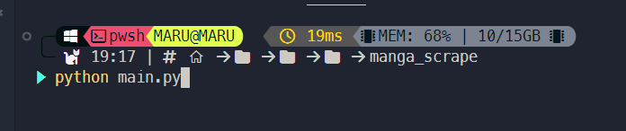
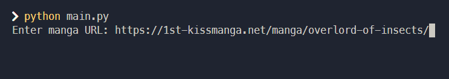
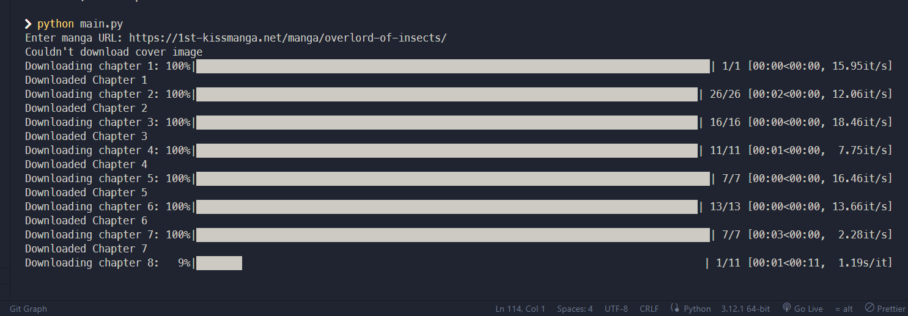

# Manga Scraping Python Script

You will provide the link of the manga. This script will download the chapters.

I've initially made this script to load offline manga in the [Mihon](https://mihon.app/https:/) app (which is an open source android manga reading app).

Currently this script only works on `1st-kissmanga.net` (this website is not sketchy as it seems 😂)

##### Before running the script, ensure you have the following Python packages installed:

```
    requests
    beautifulsoup4
    tqdm
```

### File Structure

The downloaded files will be organized in the following structure:

```
    Manga_Name/
    │
    ├── cover.jpg (or other image format)
    ├── .nomedia
    ├── chapter_1/
    │   ├── image1.jpg
    │   ├── image2.jpg
    │   └── ...
    ├── chapter_2/
    │   ├── image1.jpg
    │   ├── image2.jpg
    │   └── ...
    └── ...
```

### How to run the script?

- Run the `main.py` file.
  
- Enter the manga URL

  demo url: [https://1st-kissmanga.net/manga/overlord-of-insects/](https://1st-kissmanga.net/manga/overlord-of-insects/https:/)

  
- Then, the download starts

  
